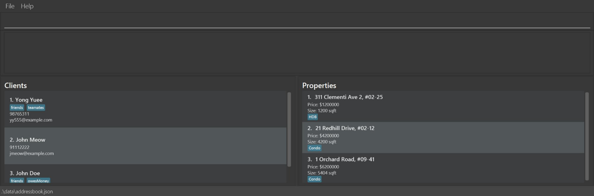

This is **a project for Software Engineering (SE) students**. It is based on the AddressBook-Level3 project created
by the [SE-EDU initiative](https://se-education.org). 

* This is **a sample project for Software Engineering (SE) students**. 
  Example usages:
  * as a starting point of a course project (as opposed to writing everything from scratch)
  * as a case study
* The project simulates an ongoing software project for a desktop application (called _AddressBook_) used for managing contact details.
  * It is **written in OOP fashion**. It provides a **reasonably well-written** code base **bigger** (around 6 KLoC) than what students usually write in beginner-level SE modules, without being overwhelmingly big.
  * It comes with a **reasonable level of user and developer documentation**.
* It is named `ClientVault`, based on the `AddressBook` project.
  * It enables property agents to quickly access and organize client contact information through a fast, keyboard-centric interface, reducing the effort required to retrieve critical client details during daily client interactions such as property size, bedrooms, how many years left etc. This also helps to link both buyers and sellers easily.
  * It is targeted towards tech-savvy property agents managing their clients’ properties
* For the detailed documentation of this project, see the **[ClientVault Product Website](https://ay2526s2-cs2103t-w13-1.github.io/tp/)**.
