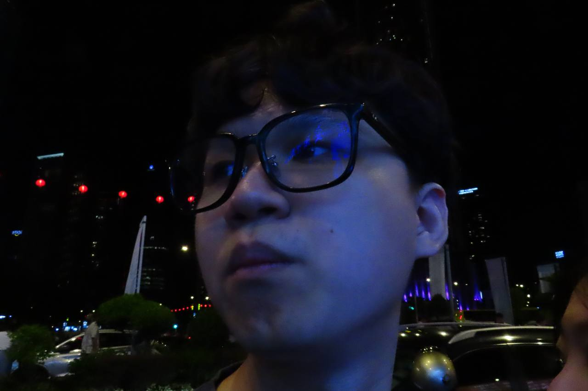

# About Us

We are a team based in the [School of Computing, National University of Singapore](http://www.comp.nus.edu.sg).

You can reach us at the email `seer[at]comp.nus.edu.sg`

## Project team

### Khoo Wui Kong

[[github](https://github.com/wuikong)]

* Role: Developer
* Role: Integration

### Liu Zhiyuan

[[github](http://github.com/LIU-ZHIYUAN-source)]
[[portfolio](team/zhiyuan.md)]

* Role: Team Lead
* Responsibilities: UI

### Ong Yong Yue

[[github](http://github.com/ongyongyue)]

* Role: Team Member
* Responsibilities: Do Stuff

### Ryan Ngau

[[github](http://github.com/creomeow)]

* Role: Developer
* Responsibilities: intern

### Wong Han Yao

[[github](http://github.com/superwhynot)]

* Role: Developer
* Responsibilities: UI
