# ClientVault User Guide

ClientVault is a **desktop app for managing clients and properties, optimized for use via a Comamnd Line Interface** (CLI) while still having the benefits of a Graphical User Interface (GUI). ClientVault can get your property agent tasks done faster than traditional GUI apps, if you type fast.

<!-- * Table of Contents -->

<page-nav-print />

---

## Quick start

1. Ensure you have Java `17` or above installed in your Computer. 
   **Mac users:** Ensure you have the precise JDK version prescribed [here](https://se-education.org/guides/tutorials/javaInstallationMac.html).
2. Download the latest `.jar` file from [here](https://github.com/AY2526S2-CS2103T-W13-1/tp/releases).
3. Copy the file to the folder you want to use as the _home folder_ for your ClientVault.
4. Open a command terminal, `cd` into the folder you put the jar file in, and use the `java -jar addressbook.jar` command to run the application. 
   A GUI similar to the below should appear in a few seconds. Note how the app contains some sample data. 
   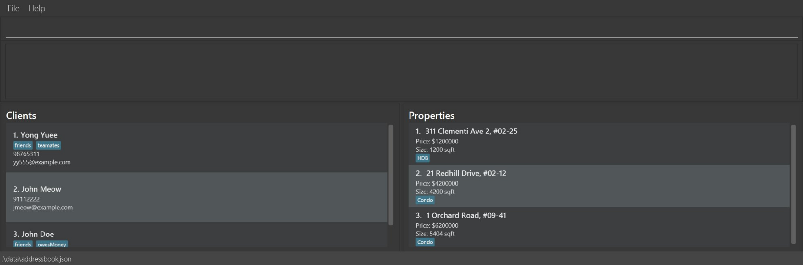
5. Type the command in the command box and press Enter to execute it. e.g. typing **`help`** and pressing Enter will open the help window. 
   Some example commands you can try:

   * `list` : Lists all contacts.
   * `addClient n/John Doe c/98765432 e/johnd@example.com` : Adds a contact named `John Doe` to the Address Book.
   * `deleteClient 3` : Deletes the 3rd client shown in the current client list.
   * `clear` : Deletes all contacts.
   * `exit` : Exits the app.
6. Refer to the [Features](#features) below for details of each command.

---

## Features

<box type="info" seamless>

**Notes about the command format:** 

* Words in `UPPER_CASE` are the parameters to be supplied by the user. 
  e.g. in `add n/NAME`, `NAME` is a parameter which can be used as `add n/John Doe`.
* Items in square brackets are optional. 
  e.g `n/NAME [t/TAG]` can be used as `n/John Doe t/friend` or as `n/John Doe`.
* Items with `…` after them can be used any number of times 
  e.g. `[t/TAG]…` can be used as ` ` (i.e. 0 times), `t/friend`, `t/friend t/family` etc.
* Parameters can be in any order. 
  e.g. if the command specifies `n/NAME c/CONTACT`, `c/CONTACT n/NAME` is also acceptable.
* Extraneous parameters for commands that do not take in parameters (such as `help`, `list`, `exit` and `clear`) will be ignored. 
  e.g. if the command specifies `help 123`, it will be interpreted as `help`.
* If you are using a PDF version of this document, be careful when copying and pasting commands that span multiple lines as space characters surrounding line-breaks may be omitted when copied over to the application.
  </box>

### Viewing help : `help`

Shows a message explaining how to access the help page.

Format: `help`

### Adding a client: `addClient`

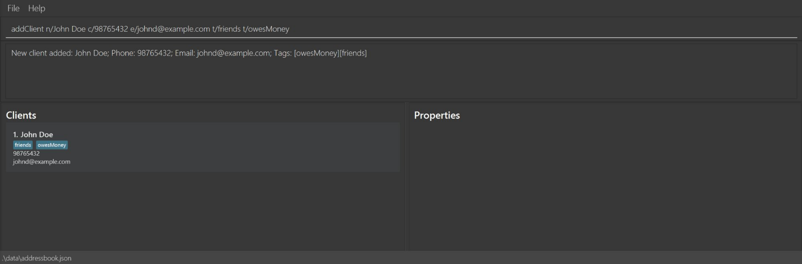
Adds a client to ClientVault.

Format: `add n/NAME c/CONTACT e/EMAIL [t/TAG]…`

<box type="tip" seamless>

**Tip:**

- A client can have any number of tags (including 0)
  </box>

Examples:

* `addClient n/John Doe c/98765432 e/johnd@example.com`
* `addClient n/Betsy Crowe e/betsycrowe@example.com c/1234567 t/vip`

### Adding a property: `addProperty`

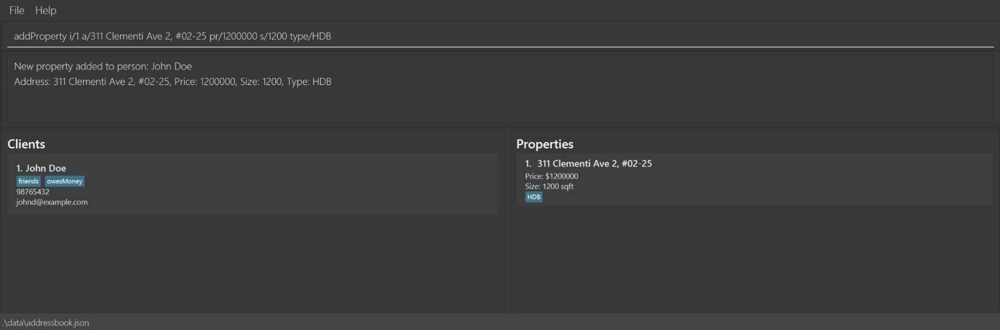
Adds a property to the client identified by the index number in the displayed client list.

Format: `addProperty i/INDEX a/ADDRESS pr/PRICE s/SIZE type/TYPE`

<box type="tip" seamless>

**Tip:**

- Use the `list` command to view the indices of clients before adding a property.
- Each property can only belong to one client.
- The `type/TYPE` field is case insensitive, ie: hdb or HDB accepted.

</box>

<box type="warning" seamless>
**Warning:**

- A property cannot be assigned to multiple clients.
- Attempting to add a property that is already owned by another client will result in an error.

</box>

Examples:

* `addProperty i/1 a/311 Clementi Ave 2, #02-25 pr/1200000 s/1200 type/HDB`
* `addProperty i/2 a/97 Panji Panji Road pr/2500000 s/1800 type/Condo`

### Listing all clients and their properties : `list`

Shows a list of all clients and their properties in the address book.

Format: `list`

### Viewing a client's details: `viewClient`

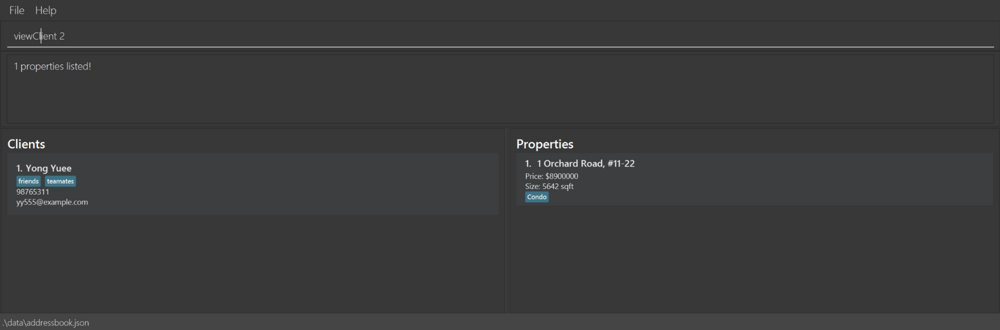
Shows the client's information and properties owned by client by index.

Format: `viewClient INDEX`

* Narrows to the client at the specified `INDEX`.
* The index refers to the index number shown in the displayed list on the client tab.
* The index **must be a positive integer** 1, 2, 3, …

Examples:

* `viewClient 1`views all relevant information with respect to the specified client.

### Viewing a client's details: `viewProperty`

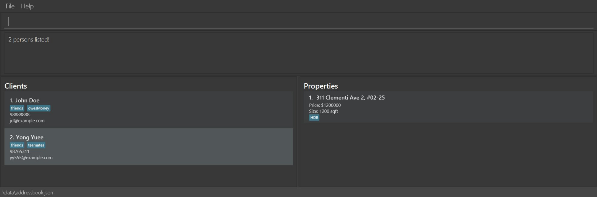
Shows the Property's information and it's owner by index.

Format: `viewProperty INDEX`

* Narrows to the property at the specified `INDEX`. The index refers to the index number shown in the displayed list on the property tab.
* The index **must be a positive integer** 1, 2, 3, …

Examples:

* `viewProperty 1`views all relevant information with respect to the specified property.

### Editing a client: `editClient`

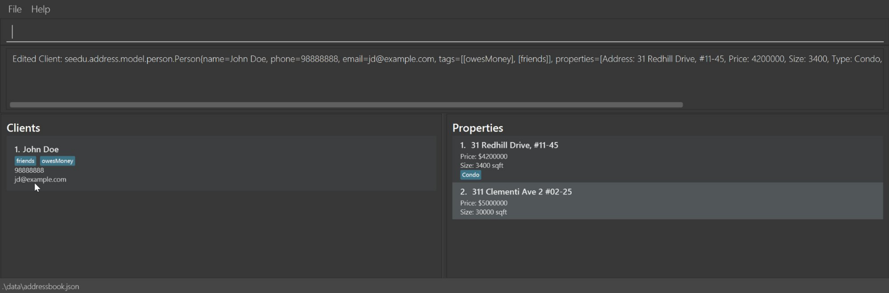
Edits the details of the client identified by the index number used in the displayed client list.
Existing values will be overwritten by the input values.

Format: `editClient INDEX [n/NAME] [c/PHONE] [e/EMAIL] [t/TAG]...`

<box type="tip" seamless>

**Tip:**

- At least one of the optional fields must be provided.
- Only the specified fields will be updated; all other fields will remain unchanged.
- If one or more `t/` prefixes are provided, the client’s existing tags will be replaced.
- You can use `t/` without a value to clear all existing tags.

</box>

Examples:

* `editClient 1 a/Amy c/91234567 e/johndoe@example.com t/vip`
* `editClient 2 n/Alex Yeoh`
* `editClient 3 t/`

### Editing a property: `editProperty`

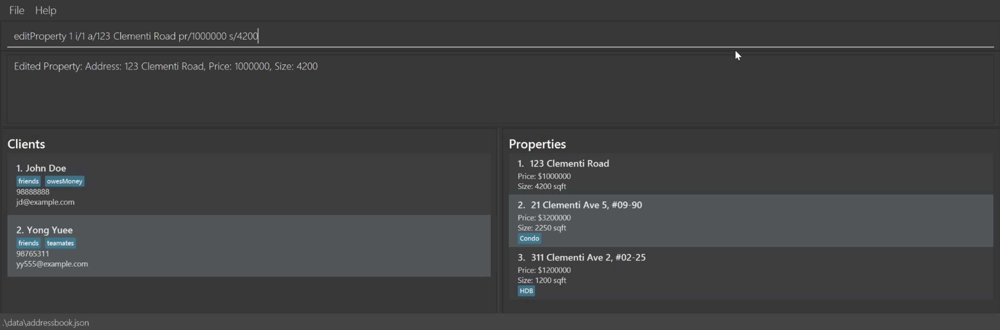
Edits the property identified by the index number in the displayed property list.
Existing values will be overwritten by the input values.

Format: `editProperty INDEX [a/ADDRESS] [pr/PRICE] [s/SIZE] [type/TYPE]`

<box type="tip" seamless>

**Tip:**

- Use the `list` command to view the indices of properties before editing a property.
- At least one of the optional fields must be provided.
- Only the specified fields will be updated; all other fields will remain unchanged.

</box>

Examples:

* `editProperty 3 a/10 Marina Bay pr/3000000 s/2000 type/HDB`
* `editProperty 1 a/123 Clementi Road`
* `editProperty 2 pr/888888`

### Adding remarks to a property : `remarkProperty`

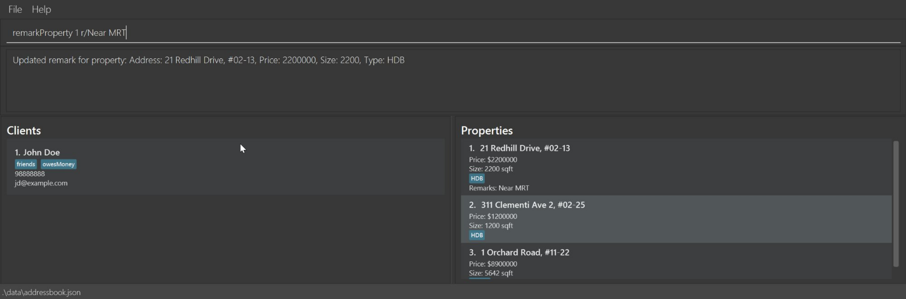
Adds a remark to the property at the specified INDEX.
Existing remarks will be overwritten by the new remark.

Format: `remarkProperty PROPERTY_INDEX r/REMARK`

* The index **must be a positive integer** 1, 2, 3, …
* Remarks cannot be changed by editProperty

**Tip:**

- You can remove a remark by typing r/ without specifying any text after it.

Examples:

* `remarkProperty 1 r/Needs renovation before move-in` adds said remark to the 1st property
* `remarkProperty 2 r/Near Chinese Garden MRT` adds said remark to the 2nd property

### Filtering clients by name and/or tag: `filterClient`

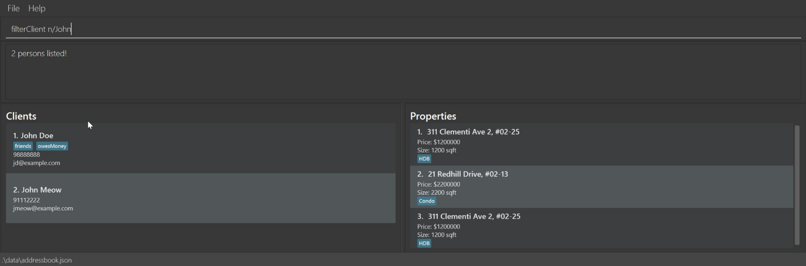
Finds clients whose names and/or tags match the given keywords.

Format: `filterClient [n/NAME_KEYWORDS] [t/TAG_KEYWORDS]`

<box type="tip" seamless>

**Tip:**

- At least one filter criterion (name keywords or tag keywords) must be provided.
- Multiple filter criteria can be combined in a single command.
- The filtered clients will match at least one keyword in each filter criterion.
- The property list will show all properties that are owned by any of the matched clients.

</box>

* Name matching is case-insensitive. e.g `hans` will match `Hans`
* Tag matching is case-insensitive. e.g `owesmoney` will match `owesMoney`
* For both name and tag filters, the order of keywords does not matter.
* Name keywords must be valid names and match full words only. e.g. `Han` will not match `Hans`
* For each prefix, clients matching at least one keyword are returned (i.e. `OR` within `n/`, `OR` within `t/`).
  e.g. `n/Hans Bo` will return `Hans Gruber`, `Bo Yang`

Examples:

* `filterClient n/John` returns `john` and `John Doe`
* `filterClient t/owesMoney` returns clients tagged `owesMoney`
* `filterClient n/alex david t/friends` returns clients whose name matches `alex` or `david`, and who are tagged `friends` 

### Filtering properties: `filterProperty`

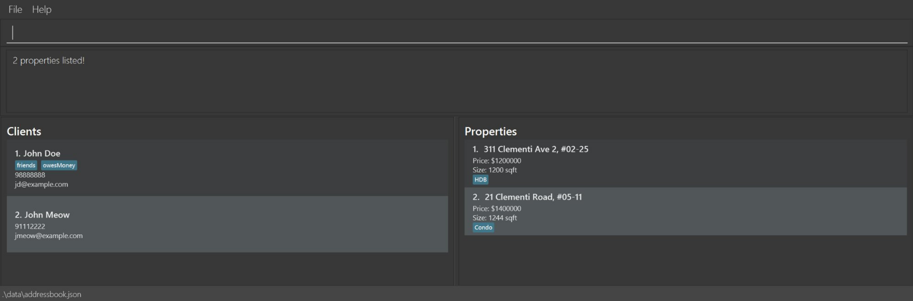
Finds properties that match the given address keywords and/or price and size ranges.

Format: `filterProperty [a/ADDRESS_KEYWORDS] [pr/MIN_PRICE MAX_PRICE] [s/MIN_SIZE MAX_SIZE]`

<box type="tip" seamless>

**Tip:**

- At least one filter criterion (address keywords, price range, or size range) must be provided.
- Multiple filter criteria can be combined in a single command.
- The client list will show all clients that own any of the matched properties.

</box>

**Address Keyword Matching:**

* The search is case-insensitive. e.g `jurong` will match `Jurong`
* The order of the keywords does not matter. e.g. `Buona Vista` will match `Vista Buona`
* Only full words will be matched e.g. `Woodland` will not match `Woodlands`
* Properties matching at least one keyword will be returned (i.e. `OR` search).
  e.g. `View Street` will return `Clementi Street 3`, `East View`

**Price Range Filtering:**

* Specify `pr/MIN_PRICE MAX_PRICE` to find properties within a price range.
* Both boundaries are inclusive.
* `MIN_PRICE` must be a non-negative integer.
* `MIN_PRICE` must be smaller than or equal to `MAX_PRICE`.

**Size Range Filtering:**

* Specify `s/MIN_SIZE MAX_SIZE` to find properties within a size range.
* Both boundaries are inclusive.
* `MIN_SIZE` must be a non-negative integer.
* `MIN_SIZE` must be smaller than or equal to `MAX_SIZE`.

Examples:

* `filterProperty a/Bukit` returns properties with "Bukit" in the address.
* `filterProperty a/punggol changi` returns properties with either "Punggol" or "Changi" in the address.
* `filterProperty pr/1000000 2000000` returns properties priced between 1,000,000 and 2,000,000.
* `filterProperty s/800 1200` returns properties with sizes between 800 and 1200 sqft.
* `filterProperty a/Clementi pr/1000000 1500000 s/1000 1500` returns properties in Clementi, priced 1-1.5M, and sized 1000-1500 sqft.

### Filtering properties by type: `filterType`

Filters properties by type (HDB, Condo).

Format: `filterType type/TYPE`

* The search is case-insensitive. e.g `hdb` will match `HDB`
* Only full words will be matched e.g. `HD` will not match `HDB
* Properties matching the specified type will be returned.
* The client list will show all clients that own any of the matched properties.

Examples:

* `filterType type/HDB` returns all HDB properties.
* `filterType type/Condo` returns all Condo properties.

### Sorting properties:

Sorts properties list based on size or price.

Format: `sortProperty st/SORT_TYPE o/ORDER`

* The sort type must be either `price` or `size`
* The order must be either `up` for ascending, or `down` for descending

Examples:

* `sortProperty st/price o/up` shows the properties ascending order based on price
* `sortProperty st/size o/down` shows the properties in an descending order based on size

### Deleting a client : `deleteClient`

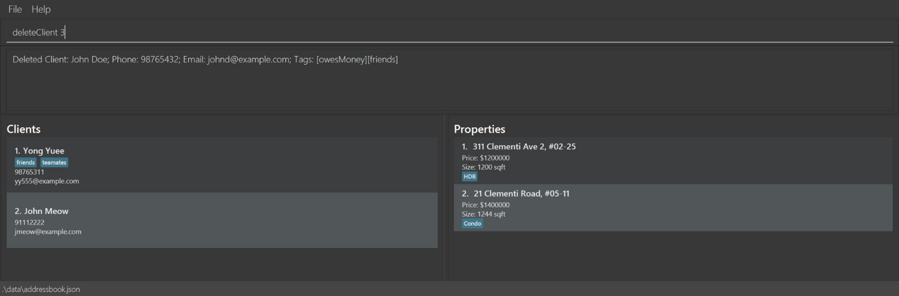
Deletes the specified client from the client list and all of the client's properties from the property list.

Format: `deleteClient INDEX`

* Deletes the client at the specified `INDEX`.
* All properties that are owned by the client will also be deleted.
* The index refers to the index number shown in the displayed client list on the left.
* The index **must be a positive integer** 1, 2, 3, …

Examples:

* `list` followed by `deleteClient 2` deletes the 2nd client in the client list, as well as the 2nd client's properties.
* `filterClient n/Betsy` followed by `deleteClient 1` deletes the 1st client in the results of the `filterClient` command, as well as the 1st client's properties.

### Deleting a property : `deleteProperty`

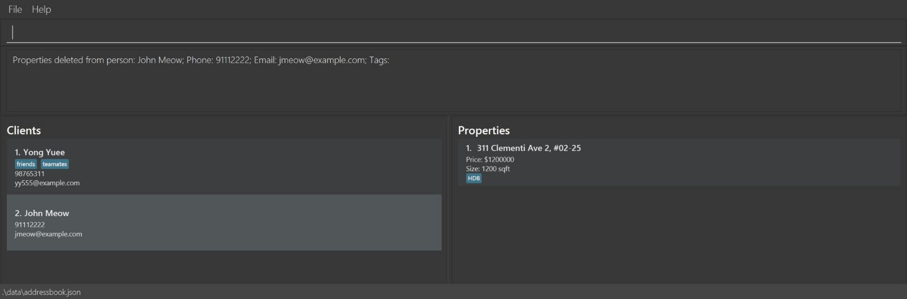
Deletes the specified property from the address book.

Format: `deleteProperty INDEX`

* Deletes the property at the specified `INDEX`.
* The index refers to the index number shown in the displayed property list on the right.
* The index **must be a positive integer** 1, 2, 3, …

Examples:

* `list` followed by `deleteProperty 2` deletes the 2nd property in the address book.
* `find john` followed by `deleteProperty 1` deletes the 1st property in the results of the `find` command.

### Clearing all entries : `clear`

Clears all entries from the address book.

Format: `clear`

### Exiting the program : `exit`

Exits the program.

Format: `exit`

### Saving the data

ClientVault data are saved in the hard disk automatically after any command that changes the data. There is no need to save manually.

### Editing the data file

ClientVault data are saved automatically as a JSON file `[JAR file location]/data/addressbook.json`. Advanced users are welcome to update data directly by editing that data file.

<box type="warning" seamless>

**Caution:**
If your changes to the data file makes its format invalid, ClientVault will discard all data and start with an empty data file at the next run.  Hence, it is recommended to take a backup of the file before editing it. 
Furthermore, certain edits can cause the ClientVault to behave in unexpected ways (e.g., if a value entered is outside the acceptable range). Therefore, edit the data file only if you are confident that you can update it correctly.
</box>

### Archiving data files `[coming in v2.0]`

_Details coming soon ..._

---

## FAQ

**Q**: How do I transfer my data to another Computer? 
**A**: Install the app in the other computer and overwrite the empty data file it creates with the file that contains the data of your previous ClientVault home folder.

**Q**: Where can I find my data file?  
**A**: You can find it in `data/addressbook.json`.

**Q**: Do I need to manually save my data before exiting? 
**A**: You do not need to manually save. Saving is done automatically.

**Q**: Do I need internet access to use this app? 
**A**: You do not need an internet connection to access the full functionality of this app.

**Q**: Why does my command fail for an invalid index? 
**A**: The index searched may not match any record currently displayed. The index will only work on what is displayed in ClientVault.

---

## Known issues

1. **When using multiple screens**, if you move the application to a secondary screen, and later switch to using only the primary screen, the GUI will open off-screen. The remedy is to delete the `preferences.json` file created by the application before running the application again.
2. **If you minimize the Help Window** and then run the `help` command (or use the `Help` menu, or the keyboard shortcut `F1`) again, the original Help Window will remain minimized, and no new Help Window will appear. The remedy is to manually restore the minimized Help Window.

---

## Command summary

| Action              | Format, Examples                                                                                                                                          |
| --------------------- | ----------------------------------------------------------------------------------------------------------------------------------------------------------- |
| **Help**            | `help`                                                                                                                                                    |
| **Add Client**      | `addClient n/NAME c/CONTACT e/EMAIL [t/TAG]…`   e.g., `add n/James Ho c/22224444 e/jamesho@example.com t/friend t/colleague`                          |
| **Add Property**    | `addProperty i/INDEX a/ADDRESS pr/PRICE s/SIZE type/TYPE`   e.g., `addProperty i/1 a/311 Clementi Ave 2, #02-25 pr/1200000 s/1200 type/HDB`            |
| **List**            | `list`                                                                                                                                                    |
| **View Client**     | `viewClient INDEX`   e.g., `viewClient 1`                                                                                                              |
| **View Property**   | `viewProperty INDEX`   e.g., `viewProperty 1`                                                                                                          |
| **Edit Client**     | `editClient INDEX [n/NAME] [c/CONTACT] [e/EMAIL] [t/TAG]...`  e.g., `editClient 2 n/Alex Yeoh`                                                         |
| **Edit Property**   | `editProperty INDEX [a/ADDRESS] [pr/PRICE] [s/SIZE] [type/TYPE]`  e.g., `editProperty 1 a/123 Clementi Road pr/500000 s/1200 type/HDB`                 |
| **Remark Property** | `remarkProperty PROPERTY_INDEX  r/REMARKS`   e.g., `remarkProperty 2 r/Near Chinese Garden MRT`                                                        |
| **Filter Client**   | `filterClient [n/NAME_KEYWORDS] [t/TAG_KEYWORDS]`  e.g., `filterClient n/James Jake t/friends`                                                         |
| **Filter Property** | `filterProperty [a/ADDRESS_KEYWORDS] [pr/MIN_PRICE MAX_PRICE] [s/MIN_SIZE MAX_SIZE]`  e.g., `filterProperty a/Clementi pr/1000000 1500000 s/1000 1500` |
| **Filter Type**     | `filterType type/TYPE`   e.g., `filter type/HDB`                                                                                                       |
| **Sort Property**   | `sortProperty st/SORT_TYPE o/ORDER`   e.g., `sortProperty st/price o/up`                                                                               |
| **Delete Client**   | `deleteClient INDEX`  e.g., `deleteClient 3`                                                                                                           |
| **Delete Property** | `deleteProperty INDEX`  e.g., `deleteProperty 3`                                                                                                       |
| **Clear**           | `clear`                                                                                                                                                   |
| **Exit**            | `exit`                                                                                                                                                    |
